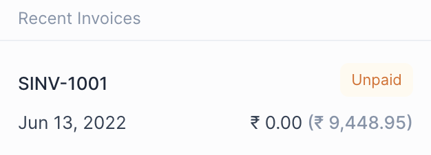

# Party

_Party_ is a term used in OdinPOS for any entity to whom a Sale or from
whom a Purchase is made.

## Types of Party

A Party is classified by their Role it's used for.

|   # | Role     | Name     | Invoice                     | Navigation              |
| --: | :------- | :------- | :-------------------------- | :---------------------- |
|   1 | Customer | Customer | Sales Invoices              | `Sales > Customers`     |
|   2 | Supplier | Supplier | Purchase Invoices           | `Purchases > Suppliers` |
|   3 | Both     | Party    | Sales and Purchase Invoices | `Common > Party`        |

::: warning Usage
Make sure that you create the Party under the correct Navigation as this cannot
be changed after creation.
:::

## Party Fields

1. Party Image: an image to identify the Party by.
2. Party Name: a name to identify the Party by, each Party should have a unique name.
3. Email: the Party's email address that may be displayed when printing the invoice.
4. Phone: the Party's phone number that may be displayed when printing the invoice.
5. Address: the Party's address that may be displayed when printing the invoice.
6. Default Account: default account that may be credited or debited when a
   transaction involving the part is made.
7. Currency: the currency in which to create the invoice for the Party.
8. Role: the role of the Party, whether they are a Customer, Supplier or Both.

## Recent Invoices

The Party Quick Edit Form has a Recent Invoices widget. This shows the last
three invoices made for a Party.

Each row shows the following information

- Invoice Name
- Invoice Status
- Date
- Paid Amount
- Outstanding Amount

Clicking on a row will take you to the Invoice from where [Payments can be made](/transactions/payments#making-payments-from-invoices).
