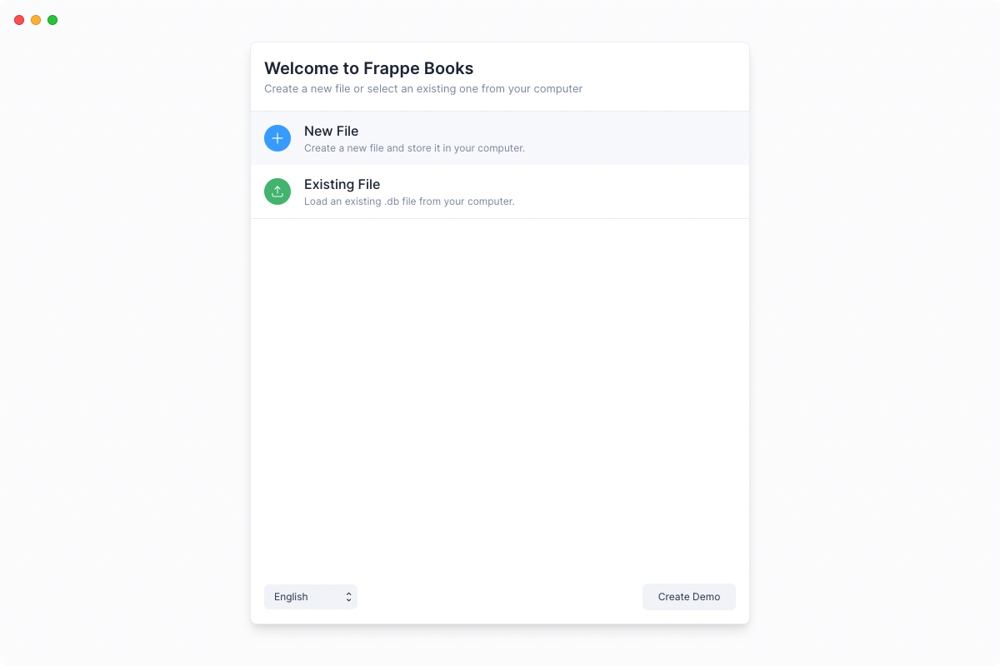
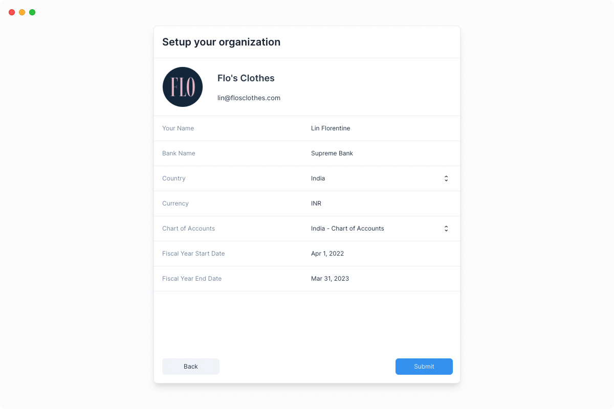

# Getting Started with OdinPOS

Let’s start applying what we have learned so far by setting up your company in
OdinPOS.

If you have not downloaded OdinPOS, you can download it from here
[frappebooks.com/download](https://frappebooks.com/download).

## Setup Instance

When you open OdinPOS, you’ll be presented two options: **New File** and
**Existing File**. If this is the first time you are opening OdinPOS, click on
**New File**.

Now select an appropriate location where you want to store the file and give it
a name.

::: tip File Location
OdinPOS stores all your company data and transactions on a local `.db` file on
your computer.

You can change the location of this `.db` file. If you have done so you can find it
again by selecting the **Existing File** option.
:::

Now, enter your Business Name, Business Email and Country Information. This will
help set up the correct Chart of Accounts based on your country.

::: tip Chart of Accounts
If you don't find the Chart of Accounts of your country, you can select the
**Standard Chart of Accounts**.
:::

---

Congratulations! You now have a company set up on OdinPOS.

You can now move onto the next step to create some initial entries before you
can start recording your invoices and transactions.
